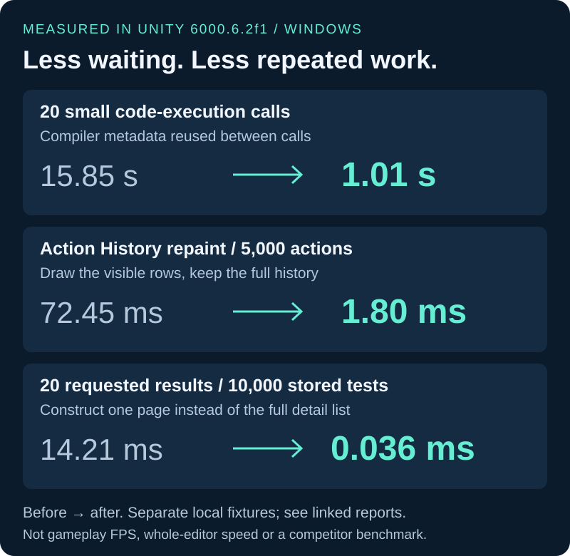
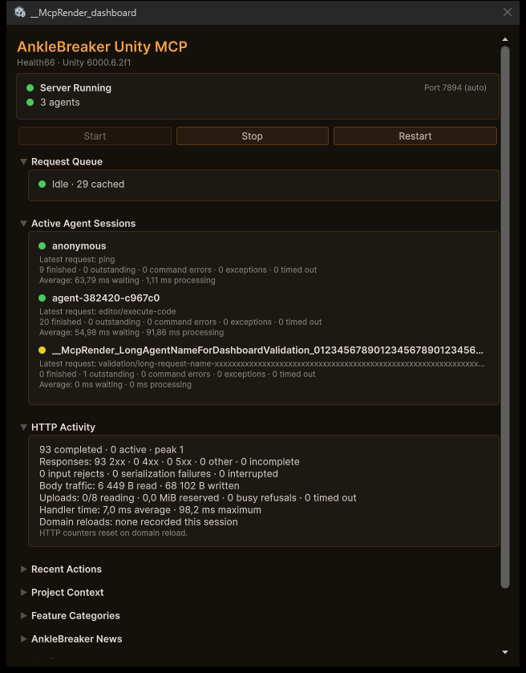

<p align="center">
  
</p>

# AnkleBreaker Unity MCP

[](https://github.com/AnkleBreaker-Studio/unity-mcp-server/actions/workflows/test.yml?query=branch%3ADevelopment-Unity66-Modernization)
[](https://github.com/AnkleBreaker-Studio/unity-mcp-plugin/actions/workflows/checks.yml?query=branch%3ADevelopment-Unity66-Modernization)

**Build worlds. Coordinate agents. See every action.** Connect your AI assistants to scene authoring, running games, multiplayer scenarios, tests, builds and profiling through Model Context Protocol. Built by [AnkleBreaker Studio](https://github.com/AnkleBreaker-Studio) for workflows that span more than one editor and one assistant.

[Get started](#get-started) · [Watch the demos](#watch-it-build-a-playable-prototype) · [Measured improvements](#measured-improvements) · [Multiple projects](#multiple-projects-multiple-agents) · [Tool catalog](docs/features.md) · [Changelog](CHANGELOG.md)

| 347 named operations | 80 exposed MCP tools | 269 advanced tools on demand |
|:---:|:---:|:---:|
| Editor, Hub and integrations | Small initial discovery surface | Search a category, fetch one schema, run it |

Counts reflect the checked-in definitions; optional tools require their corresponding Unity packages. The advanced proxy also discovers routes advertised by newer plugins.

## Watch it build a playable prototype

**Neon brick breaker:** scene construction, materials, gameplay scripts and visual iteration, with the assistant and Unity visible together.

[](https://cdn.jsdelivr.net/gh/AnkleBreaker-Studio/unity-mcp-server@513fca2/docs/media/showcase-brickbreaker.mp4)

**[▶ Open video · 25 seconds](https://cdn.jsdelivr.net/gh/AnkleBreaker-Studio/unity-mcp-server@513fca2/docs/media/showcase-brickbreaker.mp4)** · [Download MP4](https://raw.githubusercontent.com/AnkleBreaker-Studio/unity-mcp-server/Development-Unity66-Modernization/docs/media/showcase-brickbreaker.mp4) · [Village and castle demos](#from-environments-to-playable-levels)

Recorded, accelerated excerpts. The silent videos export the same recordings as the GIFs; their duration is not a build-time benchmark. [Media details and example prompts](docs/demos.md).

## Built for demanding Unity workflows

| Your workflow | What AnkleBreaker provides |
|---|---|
| **Several projects and agents** | Independent request routing, explicit project selection and a fair queue for each editor. [Architecture](docs/architecture.md) |
| **Multiplayer iteration** | MPPM scenario/player controls and parent/virtual-player discovery, plus ParrelSync identity. [Workflow and live tests](docs/multiplayer.md) |
| **Work you can inspect** | Agent history, named undo for supported actions, queue timings, command errors and the Unity Dashboard. [Monitoring](docs/queue-monitoring.md) |
| **Mixed versions and interrupted calls** | Per-editor capability detection, legacy fallback and protected retries when both components support them. [Compatibility](docs/compatibility.md) / [Retry contract](docs/queue-protocol.md) |
| **A full production toolset** | Scene authoring, builds, profiling, packages and optional integrations, with advanced schemas discovered on demand. [Tool guide](docs/features.md) |

The combination is the strength: routing, scheduling, multiplayer controls and observable results in one workflow. See [choosing a Unity integration](docs/comparison.md) for a sourced comparison.

**Why choose AnkleBreaker?** Each agent keeps its project identity, each editor has its own queue, and supported actions leave a history you can inspect and undo. Advanced tools extend that workflow into multiplayer iteration, Unity Hub and project-specific integrations. Those behaviors have dedicated regression checks and real-editor evidence, not just a feature list.

## Get started

**Development preview:** this README describes `Development-Unity66-Modernization`, which has not been released. The commands below install that branch in both repositories. For the existing release line, use the [default-branch instructions](https://github.com/AnkleBreaker-Studio/unity-mcp-server).

### 1. Add the Unity plugin

In Unity, open **Window → Package Manager → Add package from git URL**:

```text
https://github.com/AnkleBreaker-Studio/unity-mcp-plugin.git#Development-Unity66-Modernization
```

The plugin dashboard is at **Window → AB Unity MCP → Dashboard**. Verify the bridge is running there.

### 2. Install the server

Use Node.js 18 or newer; a maintained Node.js LTS is recommended.

```bash
git clone --branch Development-Unity66-Modernization https://github.com/AnkleBreaker-Studio/unity-mcp-server.git
cd unity-mcp-server
npm ci
```

### 3. Connect your assistant

For clients that accept an `mcpServers` JSON configuration:

```json
{
  "mcpServers": {
    "unity": {
      "command": "node",
      "args": ["C:/path/to/unity-mcp-server/src/index.js"]
    }
  }
}
```

Use the absolute path to your checkout. On macOS and Linux, use its Unix path. Clients with another configuration format need the same command and arguments. Restart or reconnect the client's MCP session after editing the configuration.

Editor discovery is automatic. Unity Hub is only needed for Hub commands; set `UNITY_HUB_PATH` if it is installed elsewhere. See [all configuration options](docs/configuration.md).

### 4. Try a complete workflow

> List my running Unity projects. Select my prototype, inspect its scene and compilation errors, create a platform, then capture the scene so I can review it.

> Find the multiplayer tools. List my MPPM scenarios and the players configured in the selected project.

> Inspect the scene's memory use and largest objects, then show me the actions performed by each agent.

## From environments to playable levels

### A village, built and refined in Unity

Terrain, houses, materials, trees, fences and paths: the assistant constructs a scene and inspects the result as it goes.

[](https://cdn.jsdelivr.net/gh/AnkleBreaker-Studio/unity-mcp-server@513fca2/docs/media/showcase-village.mp4)

**[▶ Open video · 25 seconds](https://cdn.jsdelivr.net/gh/AnkleBreaker-Studio/unity-mcp-server@513fca2/docs/media/showcase-village.mp4)** · [Download MP4](https://raw.githubusercontent.com/AnkleBreaker-Studio/unity-mcp-server/Development-Unity66-Modernization/docs/media/showcase-village.mp4)

### A castle you can walk through

Multi-room construction, lighting adjustment and a first-person walkthrough in the recorded project.

[](https://cdn.jsdelivr.net/gh/AnkleBreaker-Studio/unity-mcp-server@513fca2/docs/media/showcase-castle.mp4)

**[▶ Open video · 18 seconds](https://cdn.jsdelivr.net/gh/AnkleBreaker-Studio/unity-mcp-server@513fca2/docs/media/showcase-castle.mp4)** · [Download MP4](https://raw.githubusercontent.com/AnkleBreaker-Studio/unity-mcp-server/Development-Unity66-Modernization/docs/media/showcase-castle.mp4)

[All demonstrations, prompts and media formats →](docs/demos.md)

## Multiple projects, multiple agents

<p align="center">
  
</p>

Keep an agent on your game, another on a package test project, and use the multiplayer tools to inspect Host/Client scenarios. Project routing and per-agent scheduling are separate responsibilities, so requests retain their destination while waiting for Unity.

1. Call `unity_list_instances` and identify the project by name and path.
2. Call `unity_select_instance` with `projectName` or a discovered `port`.
3. Include that `port` on editor calls when coordinating simultaneous tasks.
4. Discover again after an editor restart: ports are dynamic.

Discovery checks the live Unity identity before adopting a port, including registry and default-port fallbacks. Named selection keeps that identity through verification, and stale discovery cannot overwrite a newer project choice. [Identity, concurrent selection and compatibility](docs/discovery.md).

```json
{"name":"unity_editor_state","arguments":{"port":7891}}
```

`7891` is an example; use the port returned by discovery. MCP callers can pass `_meta.agentId` (or the compatible `_meta.agent_id`) to keep agent selections and queue attribution separate. Each stdio process has its own default identity.

Within an editor, the plugin serializes writes and batches up to five reads per update. Different editor processes have independent queues. Simultaneous agents can still make conflicting edits to the same object, so assign clear ownership for shared scene work.

## Explore the editor

| Build & edit | Inspect & verify | Extend & coordinate |
|---|---|---|
| Scenes, GameObjects, components | Console and compilation errors | Multiplayer Play Mode |
| Prefabs, materials, ScriptableObjects | EditMode / PlayMode test jobs | ParrelSync instances |
| Animation curves and controllers | Physics queries, scene statistics | [Unity Hub editors and modules](docs/hub.md) |
| Terrain, navigation, particles | Profiler, memory, Frame Debugger | ProBuilder, UMA, Amplify |
| UI, audio, input actions | Screenshots and action history | [Project-specific context resources](docs/resources.md) |

Discover advanced capabilities with `unity_list_advanced_tools`. Filter by category or search, retrieve the schema for the tool you need, then call it through `unity_advanced_tool`. [Full category guide and examples →](docs/features.md)

## Workflows to try next

| Goal | Ask your assistant | What makes it useful |
|---|---|---|
| **Compare two projects** | “List my editors, inspect the package versions and compilation errors in each, then summarize the differences.” | Explicit targets and independent queues. |
| **Iterate on multiplayer** | “Find the MPPM tools, inspect the selected scenario and start its configured Host and Client players.” | Native scenario and virtual-player identity. [Guide](docs/multiplayer.md) |
| **Validate a change** | “Run the selected EditMode tests, wait for the job, then show failures and fetch the detailed results in pages.” | Persistent job IDs, diagnostics and paginated reads. [Guide](docs/testing.md) |
| **Review agent work** | “Show recent actions by agent and tell me which supported actions can be undone safely.” | Native stack checks and attributed action history. [Guide](docs/undo.md) |
| **Find expensive content** | “Inspect memory consumers and mesh statistics, then capture the scene for review.” | Inspection without copying geometry buffers just to count it. [Guide](docs/mesh-metadata.md) |
| **Maintain a package** | “Compare installed packages, check compilation and inspect my build settings before making changes.” | Package requests yield to editor updates. [Guide](docs/packages.md) |

These are example prompts, not automatic scripts. Select the intended project first and let the assistant discover the current tool schemas and available packages.

## Measured improvements

<p align="center">
  
</p>

| Recorded workload | Before → after | Why it changed |
|---|---|---|
| 20 small code-execution calls | **15.85 s → 1.01 s** | Bounded compiler metadata reuse. [Measurement](docs/code-execution.md) |
| History repaint with 5,000 retained actions | **72.45 ms → 1.80 ms** | Draw only visible rows; avoid per-selection native textures. [Measurement](docs/history-window.md) |
| Construct 20 results from 10,000 stored tests | **14.21 ms → 0.036 ms** | Build the requested page instead of every detail record. [Measurement](docs/test-pagination.md) |

Measurements use separate before/after fixtures and historical baselines on Unity 6000.6.2f1 / Windows. Each linked report states its scope. These results do not measure whole-editor FPS or establish a speed ranking against other MCP products.

## Compatibility and validation

The plugin declares **Unity 2021.3.18f1+** support. Server and plugin versions advance independently and do not need matching version numbers. Current live validation uses **Unity 6000.6.2f1 on Windows**; minimum-version C# compilation also passes. Actual older-editor execution is deferred.

**263 server tests pass across eight CI configurations** (Node 18/20/22/24 on Windows/Linux), and the plugin's registry check covers **338 routes**. Real-editor workflows include mixed released/current components, two editors, MPPM Host/Client, ParrelSync and actual script reloads. These checks have different recorded source checkpoints; the [delivery summary](docs/modernization-audit.md) identifies them and the remaining coverage limits.

<details>
<summary><strong>Explore the tested workflows and their evidence</strong></summary>

| Verified workflow | Evidence and limits |
|---|---|
| Released/current components | All four server-plugin pairs on Node 18 and 22, plus concurrent agents across mixed plugin versions. [Version matrix](docs/compatibility.md) |
| Multiple editors and reloads | Overlapping calls to two editors, four Play Mode reload configurations and lost-result handling after script reload. [Validation record](docs/modernization.md) |
| Multiplayer Play Mode 3.0 | Host/Client launch, separate agent routing and shared script recompilation. [Multiplayer guide](docs/multiplayer.md) |
| ParrelSync 1.5.2 | Native clone identity, independent agents, Play Mode, shared recompilation, settings persistence and clone restart. Gameplay connections need separate validation. [Clone guide](docs/parrelsync.md) |
| Action History | Bounded observers, grouped refreshes and visible-row drawing with stable filters/selection. [Notifications](docs/history-notifications.md) · [Window costs and cleanup](docs/history-window.md) |
| History persistence | Retention-aware loading, bounded snapshots and recovery after failed saves/loads. [Compatibility and recovery](docs/history-persistence.md) |
| Agent-session retention | Recent completed identities are bounded; busy agents, polling results and global history remain protected. [Limits and validation](docs/session-retention.md) |
| Scene and asset editing | Enums, references, prefabs, rejected-write preservation and Scene capture cleanup. [Editor workflows](docs/editor-workflows.md) |
| Inline camera images | Explicit camera selection, bounded dimensions, restored render targets and decoded PNG checks with current/released servers. [Capture guide](docs/graphics-capture.md) |
| Asset previews | Loading yields to editor updates and other agents; requested sizes and metadata-only options are honored. [Preview guide](docs/asset-previews.md) |
| Mesh inspection | Both object-path names work; all eight UV channels and native triangle counts are read without copying geometry buffers. [Metadata guide and measurements](docs/mesh-metadata.md) |
| Package Manager | Requests yield between editor updates and remain sequential; list/search/info and local add/remove pass with current and released servers. [Package guide](docs/packages.md) |
| Code results | Valid JSON for non-finite/Unicode values, bounded conversion and HTTP output, and no replay after response failure. [Execution guide](docs/code-execution.md) |
| HTTP downloads | Bounded response reads, including compressed bodies and older plugins; overflow never repeats a command. [Response limits](docs/response-limits.md) |
| Request input | Complete HTTP/JSON before dispatch, 8 body readers, 64 MiB reservations and a 30-second upload deadline; server preflight avoids oversized uploads. [Input guide](docs/request-input.md) |
| Undo across agents | Native stack checks, explicit cascade handling, accurate Undo/Redo eligibility and identity preserved through script reload. [Undo guide](docs/undo.md) |
| Test Runner | Failure cleanup, native cancellation, retained job details through reload and optional pages for large results. [Testing guide](docs/testing.md) · [Pagination](docs/test-pagination.md) |
| Unity 6.6 builds | Five Windows Mono builds verify managed diagnostics and restoration of project settings. Other platforms and IL2CPP remain untested. [Build guide](docs/builds.md) |
| UMA V3.1f1 | Asset creation, race changes and recipe renames, with the integration isolated from the core bridge. [UMA guide](docs/uma.md) |

</details>

Run the server's ordinary regression suite:

```bash
npm ci
npm test
```

These tests run the real MCP stdio process against isolated mock bridges. The companion plugin's Unity runner and the server's opt-in live suites are documented with their prerequisites and results in the linked guides. [Full evidence and follow-up limits](docs/modernization.md) · [Final documentation and media checks](docs/validation/readme-media.json).

## Monitor and troubleshoot

<p align="center">
  
</p>

*Actual Dashboard capture from a Unity 6.6 validation project. The deliberately long agent/request names exercise layout behavior; displayed counters belong to that test session.*

The plugin Dashboard shows queue activity, agent sessions, HTTP activity and recent actions. Agent cards update in place, sections remember their state, and long request text stays readable through tooltips. HTTP counters include input refused before ticket creation, body traffic and domain reloads. [Dashboard behavior](docs/dashboard.md) · [HTTP fields and measurements](docs/http-monitoring.md).

Requested [editor-window captures](docs/editor-capture.md) preserve keyboard focus, identify ambiguous windows explicitly and bound native image allocations. Docked captures exclude tab chrome; inactive tabs require an explicit temporary-switch option. Owned Windows fixtures verify actual UI Toolkit/IMGUI pixels and Dashboard layouts at 360 and 640 px.

Code execution reuses bounded compiler metadata and reports cache activity in `unity_editor_state.codeExecution`. A local Unity 6.6 benchmark of twenty small calls fell from 15.85 s to 1.01 s; this measures one workload, not every Unity operation. [Execution behavior, measurements and limits](docs/code-execution.md).

- **No editor found:** check the plugin dashboard, console and discovered project path. See [connection troubleshooting](docs/configuration.md#troubleshooting).
- **Slow calls:** inspect `unity_queue_info`, `unity_agents_list` and `unity_agent_log`. Ticket status separates queue wait and processing time; queue info also exposes inactive-session retention and evictions. [Monitoring fields and measurements →](docs/queue-monitoring.md)
- **Compilation in progress:** wait for `isCompiling: false`, then inspect compilation errors. An empty error list during compilation is inconclusive.
- **Tool unavailable:** check category switches and optional packages in the dashboard. Advanced route discovery supports newer plugins without expanding the initial tool list.
- **Response too large:** request smaller read results; inspect the effects before repeating a write. [Response budgets and image handling](docs/response-limits.md).
- **Stopped a request:** the server stops waiting and polling; accepted Unity work can still finish. [Cancellation behavior](docs/cancellation.md).
- **Client registry limit:** set `UNITY_MCP_COMPACT_TOOLS=1`. Full parameter documentation remains available through advanced discovery.

## Frequently asked questions

**Which AI clients can use it?** Clients that support spawning an MCP stdio server can connect using the Node command above. Configuration syntax and image/tool support depend on the client; no specific model is required by the bridge.

**Do I need every optional Unity package?** No. The core bridge works independently of optional integrations. Enable the relevant categories and install the packages needed for your workflow; use advanced discovery to inspect available tools.

**Can several assistants work on the same project?** Yes. Requests are attributed and scheduled per agent. Assign ownership of shared objects: scheduling does not resolve conflicting design changes.

**Can I undo every AI action?** Supported Unity writes have named undo groups and history. Filesystem operations, arbitrary code and some deferred workflows have different recovery limits. Inspect the [Undo contract](docs/undo.md) before relying on rollback.

**Is this already a released upgrade?** No. This README documents the modernization branch. Existing server/plugin version numbers remain independent; the installation instructions above select the development preview explicitly.

**How does it compare?** Start with the [sourced comparison](docs/comparison.md): routing, fair scheduling, retry recovery, multiplayer controls, monitoring and tool discovery. The measured gains above compare AnkleBreaker revisions under specific workloads.

## Support and license

Support development through [GitHub Sponsors](https://github.com/sponsors/AnkleBreaker-Studio) or [Patreon](https://www.patreon.com/AnkleBreakerStudio). Report reproducible issues with the server version, plugin version, Unity version and the affected tool.

[Companion Unity plugin](https://github.com/AnkleBreaker-Studio/unity-mcp-plugin) · [Model Context Protocol](https://modelcontextprotocol.io) · [AnkleBreaker Studio](https://github.com/AnkleBreaker-Studio)

Distributed under the **AnkleBreaker Open License v1.0**. See [LICENSE](LICENSE) for the full terms, including attribution and restrictions on reselling the tool. AI client and model usage costs are separate.
