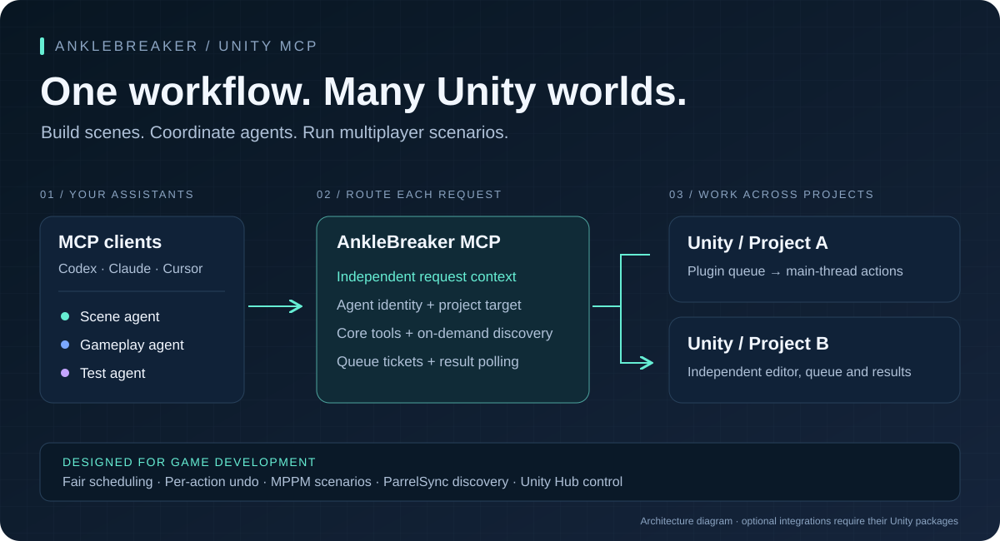
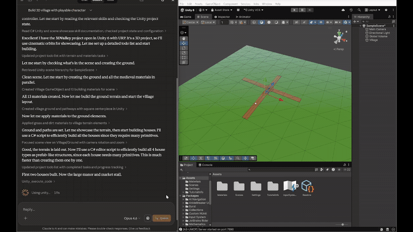

<p align="center">
  
</p>

# AnkleBreaker Unity MCP

**Your AI assistants, connected to the whole Unity workflow.** Build scenes, inspect running games, coordinate multiplayer scenarios, manage packages and profile projects through Model Context Protocol. Built by [AnkleBreaker Studio](https://github.com/AnkleBreaker-Studio).

[Get started](#get-started) · [Multi-project workflows](#multiple-projects-multiple-agents) · [Tools & demos](docs/features.md) · [Configuration](docs/configuration.md) · [Architecture](docs/architecture.md) · [Changelog](CHANGELOG.md)

| 347 named operations | 80 exposed MCP tools | 269 advanced tools on demand |
|:---:|:---:|:---:|
| Editor, Hub and integrations | Small initial discovery surface | Search a category, fetch one schema, run it |

Counts reflect the checked-in definitions; optional tools require their corresponding Unity packages. The advanced proxy also discovers routes advertised by newer plugins.

## Built for demanding Unity workflows

| Your workflow | What AnkleBreaker provides |
|---|---|
| **Several projects open** | Registry discovery, live project identity, per-agent selection and explicit routing on each call. |
| **Several agents working** | Request-local agent and port state; the plugin schedules each agent's FIFO queue in round-robin order. |
| **Multiplayer iteration** | MPPM scenario creation, activation, start/stop and player controls; discovery of ParrelSync editor clones. |
| **Long editor operations** | Ticket submission and polling, in-flight status and domain-reload recovery paths. Unity work runs on the main thread; an expensive action can still occupy it. |
| **Changes you can inspect** | Per-agent history, named undo groups for supported actions, compilation diagnostics and scene/game captures. |
| **Large tool catalogs** | Core tools immediately available; advanced discovery returns counts, search results or one full schema. Compact mode retains schema structure. |
| **Mixed plugin versions** | Per-instance queue detection, legacy synchronous fallback and an additive capability handshake. |
| **Interrupted responses** | Protocol-2 retries recover the original ticket. With older plugins, the server reports uncertain outcomes without repeating writes. [Retry contract](docs/queue-protocol.md) |
| **A game production stack** | Terrain, animation, physics, audio, navigation, UI, builds, profiling, Shader Graph, ProBuilder, Amplify and UMA tools. |

For a comparison grounded in current documentation, see [choosing a Unity integration](docs/comparison.md). Our strengths are the combined workflow, explicit routing, fair scheduling, per-action history and broad editor coverage.

## Get started

### 1. Add the Unity plugin

In Unity, open **Window → Package Manager → Add package from git URL**:

```text
https://github.com/AnkleBreaker-Studio/unity-mcp-plugin.git
```

The plugin dashboard is at **Window → AB Unity MCP → Dashboard**. Verify the bridge is running there.

### 2. Install the server

Use Node.js 18 or newer; a maintained Node.js LTS is recommended.

```bash
git clone https://github.com/AnkleBreaker-Studio/unity-mcp-server.git
cd unity-mcp-server
npm ci
```

### 3. Connect your assistant

For clients that accept an `mcpServers` JSON configuration:

```json
{
  "mcpServers": {
    "unity": {
      "command": "node",
      "args": ["C:/path/to/unity-mcp-server/src/index.js"]
    }
  }
}
```

Use the absolute path to your checkout. On macOS and Linux, use its Unix path. Clients with another configuration format need the same command and arguments. Restart or reconnect the client's MCP session after editing the configuration.

Editor discovery is automatic. Unity Hub is only needed for Hub commands; set `UNITY_HUB_PATH` if it is installed elsewhere. See [all configuration options](docs/configuration.md).

### 4. Try a complete workflow

> List my running Unity projects. Select my prototype, inspect its scene and compilation errors, create a platform, then capture the scene so I can review it.

> Find the multiplayer tools. List my MPPM scenarios and the players configured in the selected project.

> Inspect the scene's memory use and largest objects, then show me the actions performed by each agent.

## Multiple projects, multiple agents

1. Call `unity_list_instances` and identify the project by name and path.
2. Call `unity_select_instance` with `projectName` or a discovered `port`.
3. Include that `port` on editor calls when coordinating simultaneous tasks.
4. Discover again after an editor restart: ports are dynamic.

```json
{"name":"unity_editor_state","arguments":{"port":7891}}
```

`7891` is an example; use the port returned by discovery. MCP callers can pass `_meta.agentId` (or the compatible `_meta.agent_id`) to keep agent selections and queue attribution separate. Each stdio process has its own default identity.

Within an editor, the plugin serializes writes and batches up to five reads per update. Different editor processes have independent queues. Simultaneous agents can still make conflicting edits to the same object, so assign clear ownership for shared scene work.

## Explore the editor

| Build & edit | Inspect & verify | Extend & coordinate |
|---|---|---|
| Scenes, GameObjects, components | Console and compilation errors | Multiplayer Play Mode |
| Prefabs, materials, ScriptableObjects | EditMode / PlayMode test jobs | ParrelSync instances |
| Animation curves and controllers | Physics queries, scene statistics | Unity Hub editors and modules |
| Terrain, navigation, particles | Profiler, memory, Frame Debugger | ProBuilder, UMA, Amplify |
| UI, audio, input actions | Screenshots and action history | Project-specific context resources |

Discover advanced capabilities with `unity_list_advanced_tools`. Filter by category or search, retrieve the schema for the tool you need, then call it through `unity_advanced_tool`. [Full category guide and examples →](docs/features.md)

<details>
<summary><strong>Watch a scene-building demo</strong></summary>

<p align="center">
  
</p>

[More demonstrations: brick breaker, village and castle](docs/features.md).

</details>

## Compatibility and validation

The plugin declares **Unity 2021.3+** support and retains version-gated object identity APIs. Server and plugin versions advance independently; they do not need matching version numbers.

The current modernization branch has been compiled and exercised in **Unity 6000.6.2f1**: object ID round-trips, queue ordering, read batching, deferred completion and legacy synchronous calls. This is a focused validation, not certification of every optional package or multiplayer configuration. [Evidence, limits and remaining work →](docs/modernization.md)

```bash
npm ci
npm test
```

The server tests run the real MCP stdio process against isolated mock bridges, including overlapping calls to different projects and mixed old/new plugins. The companion plugin includes a reproducible Unity batch validation runner under `tools~/validate-unity.ps1`.

## Monitor and troubleshoot

- **No editor found:** check the plugin dashboard, console and discovered project path. See [connection troubleshooting](docs/configuration.md#troubleshooting).
- **Slow calls:** inspect `unity_queue_info`, `unity_agents_list` and `unity_agent_log`. New plugin ticket status includes `queueWaitMs` and `processingTimeMs`; `executionTimeMs` retains its existing total-latency meaning.
- **Compilation in progress:** wait for `isCompiling: false`, then inspect compilation errors. An empty error list during compilation is inconclusive.
- **Tool unavailable:** check category switches and optional packages in the dashboard. Advanced route discovery supports newer plugins without expanding the initial tool list.
- **Client registry limit:** set `UNITY_MCP_COMPACT_TOOLS=1`. Full parameter documentation remains available through advanced discovery.

## Support and license

Support development through [GitHub Sponsors](https://github.com/sponsors/AnkleBreaker-Studio) or [Patreon](https://www.patreon.com/AnkleBreakerStudio). Report reproducible issues with the server version, plugin version, Unity version and the affected tool.

[Companion Unity plugin](https://github.com/AnkleBreaker-Studio/unity-mcp-plugin) · [Model Context Protocol](https://modelcontextprotocol.io) · [AnkleBreaker Studio](https://github.com/AnkleBreaker-Studio)

Distributed under the **AnkleBreaker Open License v1.0**. See [LICENSE](LICENSE) for the full terms, including attribution and restrictions on reselling the tool. AI client and model usage costs are separate.
