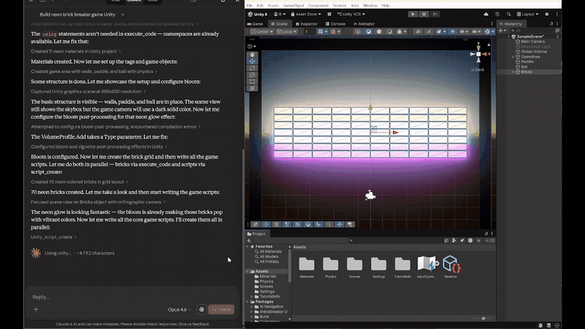
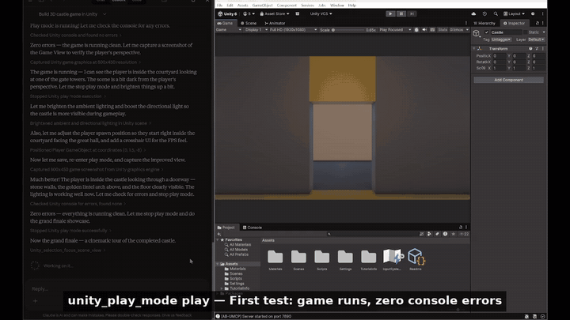

# Tools and demonstrations

For serialized enum values, asset-result limits, capture cleanup and repeatable live validation, see [editor workflow contracts](editor-workflows.md).

Watch the inline GIFs below, or open the [video gallery with MP4 downloads and example prompts](demos.md). These are accelerated recordings, not timings for the current branch.

### Neon Brick Breaker — From scene setup to a playable prototype
> Claude creates the entire game: scene setup, neon materials with bloom post-processing, brick grid layout, game scripts, VFX, and UI — all through Unity MCP commands.

  

[Open the 25-second video](media/showcase-brickbreaker.mp4).

### 3D Medieval Village — AI-generated terrain, houses, and environment
> From an empty scene to a fully decorated village: terrain sculpting, material creation, procedural house building via C# editor scripts, trees, fences, and pathways.

  

[Open the 25-second video](media/showcase-village.mp4).

### 3D Castle — Complete level with FPS walkthrough
> AI builds a multi-room castle with courtyard, throne room, armory, and guard room. Adjusts lighting, spawns the player, and runs an FPS walkthrough to verify the result.

  

[Open the 18-second video](media/showcase-castle.mp4).

## Features

**347 named operations** covering the full Unity workflow:

| Category | Tools |
|----------|-------|
| **Unity Hub** | List/install editors, manage modules, set install paths. [Results and failure handling](hub.md) |
| **Scenes** | Open, save, create scenes, get full hierarchy tree with pagination |
| **GameObjects** | Create (primitives/empty), delete, duplicate, reparent, activate/deactivate, transform (world/local) |
| **Components** | Add, remove, get/set any serialized property, wire object references, batch wire |
| **Assets** | List, import, delete, search, create prefabs, create & assign materials |
| **Scripts** | Create, read, update C# scripts |
| **Builds** | Multi-platform builds (Windows, macOS, Linux, Android, iOS, WebGL) |
| **Console & Compilation** | Read/clear Unity console logs (errors, warnings, info); get C# compilation errors via CompilationPipeline (independent of console buffer) |
| **Testing** | Run EditMode/PlayMode tests, poll results, list available tests via Unity Test Runner API |
| **Play Mode** | Play, pause, stop |
| **Editor** | Execute menu items, run C# code, get editor state, undo/redo |
| **Project** | Project info, packages (list/add/remove/search), render pipeline, build settings |
| **Animation** | List clips & controllers, get parameters, play animations |
| **Prefab** | Open/close prefab mode, get overrides, apply/revert changes |
| **Physics** | Raycasts, sphere/box casts, overlap tests, physics settings |
| **Lighting** | Manage lights, environment, skybox, lightmap baking, reflection probes |
| **Audio** | AudioSources, AudioListeners, AudioMixers, play/stop, mixer params |
| **Terrain** | Create/modify terrains, paint heightmaps/textures, manage terrain layers, trees, details |
| **Navigation** | NavMesh baking, agents, obstacles, off-mesh links |
| **Particles** | Particle system creation, inspection, module editing |
| **UI** | Canvas, UI elements, layout groups, event system |
| **Tags & Layers** | List/add/remove tags, assign tags & layers |
| **Selection** | Get/set editor selection, find by name/tag/component/layer/tag |
| **Graphics** | Scene and game view capture (inline images for visual inspection) |
| **Input Actions** | Action maps, actions, bindings (Input System package) |
| **Assembly Defs** | List, inspect, create, update .asmdef files |
| **ScriptableObjects** | Create, inspect, modify ScriptableObject assets |
| **Constraints** | Position, rotation, scale, aim, parent constraints |
| **LOD** | LOD group management and configuration |
| **Profiler** | Start/stop profiling, stats, deep profiles, save profiler data |
| **Frame Debugger** | Enable/disable, draw call list & details, render targets |
| **Memory Profiler** | Memory breakdown, top consumers, snapshots (`com.unity.memoryprofiler`) |
| **Shader Graph** | List, inspect, create, open Shader Graphs & Sub Graphs; VFX Graphs |
| **Amplify Shader Editor** | Full graph manipulation — create, inspect, add/remove/connect/disconnect/duplicate nodes, set properties, templates, save/close (if installed) |
| **MPPM Scenarios** | List, activate, start, stop multiplayer playmode scenarios; get status & player info |
| **Multi-Instance** | Discover and switch between multiple running Unity Editor instances |
| **Multi-Agent** | List active agents, get agent action logs, queue monitoring |
| **SpriteAtlas** | Create, inspect, add/remove sprites, configure settings, delete, list SpriteAtlases |
| **UMA (Unity Multipurpose Avatar)** | Create slots, overlays, wardrobe recipes from FBX; equip/unequip items on DCA; browse/rebuild Global Library |
| **Project Context** | Auto-inject project-specific docs and guidelines for AI agents |

